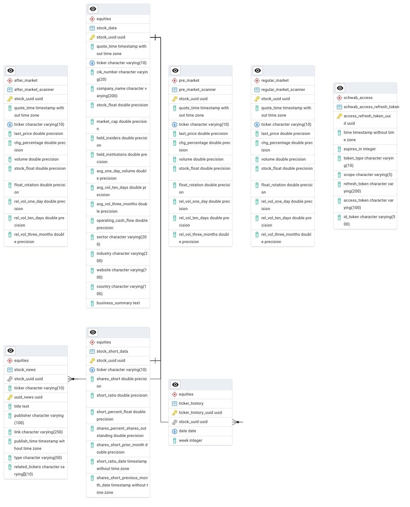

# Stock Market Scanner

A comprehensive Python application that automatically scans and tracks stock market movers across pre-market, regular market, and after-market trading sessions. The scanner aggregates data from multiple sources including Charles Schwab API, StockAnalysis.com, and other official APIs to identify top gainers, losers, and most active stocks.

---

## Table of Contents

- [Critical Legal Warnings](#️-critical-legal-warnings---read-before-use)
  - [Web Scraping Notice](#-web-scraping-notice)
  - [Your Legal Responsibilities](#️-your-legal-responsibilities)
  - [Recommended Legal Alternatives](#-recommended-legal-alternatives)
  - [Responsible Use Guidelines](#️-responsible-use-guidelines)
  - [Financial and Investment Disclaimer](#-financial-and-investment-disclaimer)
- [Features](#features)
- [Requirements](#requirements)
- [Installation](#installation)
  - [Clone the Repository](#1-clone-the-repository)
  - [Install Python Dependencies](#2-install-python-dependencies)
  - [Set Up PostgreSQL Database](#3-set-up-postgresql-database)
  - [Configure Application Settings](#4-configure-application-settings)
- [Database Schema](#database-schema)
- [Usage](#usage)
  - [Running the Scanner](#running-the-scanner)
  - [Searching for Specific Stocks](#searching-for-specific-stocks)
  - [Using Individual Scanner Classes](#using-individual-scanner-classes)
- [Architecture](#architecture)
- [How It Works](#how-it-works)
- [Data Collected](#data-collected)
- [Schwab API Authentication](#schwab-api-authentication)
- [Configuration](#configuration)
  - [Sleep Time and Rate Limiting](#sleep-time-and-rate-limiting)
- [Graceful Shutdown](#graceful-shutdown)
- [Error Handling](#error-handling)
- [Future Enhancements](#future-enhancements)
- [Contributing](#contributing)
- [License](#license)
- [Disclaimer](#disclaimer)
- [Support](#support)

---

## ⚠️ CRITICAL LEGAL WARNINGS - READ BEFORE USE

### 🚨 Web Scraping Notice

**THIS SOFTWARE INCLUDES WEB SCRAPING FUNCTIONALITY FOR:**
- **StockAnalysis.com** - Their robots.txt allows crawling, and Terms of Use do not explicitly prohibit scraping. However, you MUST comply with their attribution requirement.

### ⚖️ Your Legal Responsibilities

**BY USING THIS SOFTWARE, YOU ACKNOWLEDGE AND AGREE THAT:**

1. **YOU MUST PROVIDE ATTRIBUTION** to StockAnalysis.com when using their data
   - Per their ToS: "you can use snippets of the content as long as you do not modify the content and clearly state where you got it from"
   - Example attribution: "Data sourced from https://stockanalysis.com/"

2. **YOU ARE SOLELY RESPONSIBLE** for:
   - Complying with StockAnalysis.com's Terms of Use
   - Not modifying scraped content
   - Not republishing full content without permission
   - Monitoring for rate limits and blocks (HTTP 403/429 errors)

3. **THE AUTHORS AND CONTRIBUTORS:**
   - Provide NO warranty that this software complies with any ToS
   - Accept NO liability for your use of this software
   - Are NOT responsible for any legal consequences you face

### ✅ Recommended Legal Alternatives

**Instead of web scraping, consider these OFFICIAL, ToS-compliant API options:**

| Service | Free Tier | Paid Plans | Status | Documentation |
|---------|-----------|------------|--------|---------------|
| **Charles Schwab** | ✅ Yes | Free | ✅ Integrated | https://developer.schwab.com/ |
| Alpha Vantage | ✅ Yes | ✅ Available | 🔧 Implemented | https://www.alphavantage.co/ |
| Polygon.io | ❌ No | ✅ Available | 🔧 Implemented | https://polygon.io/ |
| Financial Modeling Prep | ✅ Yes | ✅ Available | 🔧 Implemented | https://financialmodelingprep.com/ |
| Alpaca Markets | ✅ Yes | ✅ Available | 🔧 Implemented | https://alpaca.markets/ |

**Legend:**
- ✅ **Integrated**: Fully working in the scanner
- 🔧 **Implemented**: API client ready, needs scanner integration (see Future Enhancements)

**This project already includes API client implementations for all the above services.** We strongly recommend using official APIs instead of web scraping.

### 🛡️ Responsible Use Guidelines

If you choose to use web scraping features despite the risks:

1. **Rate Limiting**: Use delays of at least 10-60 seconds between requests
2. **Respect robots.txt**: Check each website's robots.txt file
3. **User-Agent**: This tool uses a standard browser user-agent (see scrapers.py)
4. **Personal Use Only**: Do NOT use for commercial purposes
5. **Low Volume**: Minimize the number of requests
6. **Off-Peak Hours**: Scrape during low-traffic periods
7. **Monitor for Blocks**: If you receive 429/403 errors, STOP immediately

### 📋 Financial and Investment Disclaimer

**THIS SOFTWARE IS FOR EDUCATIONAL AND RESEARCH PURPOSES ONLY**

- NOT financial advice or investment recommendations
- NOT a substitute for professional financial guidance
- Data may be inaccurate, incomplete, or outdated
- Past performance does NOT guarantee future results
- Consult licensed financial advisors before making investment decisions
- Authors assume NO responsibility for financial losses

---

## Features

- **Multi-Market Support**: Scans pre-market and regular market sessions (after-market under development)
- **Multiple Data Sources**: Currently integrated:
  - **Charles Schwab API** (official, ToS-compliant) - Primary data source for quotes, fundamentals, and movers
  - **Yahoo Finance** (via yfinance library) - Additional data (sector, industry, short interest, institutional holdings)
  - **StockAnalysis.com** (web scraping with attribution) - Ticker symbol discovery for gainers/losers
  - Additional official APIs available for integration (see Future Enhancements)
- **Comprehensive Stock Data**: Fetches fundamental data, market metrics, short interest, and company news
- **Automated Threading**: Runs scanners concurrently in separate threads
- **Database Integration**: Stores and updates stock data in PostgreSQL
- **Smart Caching**: Avoids redundant API calls with lazy loading and intelligent data refresh logic
- **News Tracking**: Automatically collects and stores company news articles

## Requirements

- Python 3.8+
- PostgreSQL 12+ (database server)
- Charles Schwab API credentials ([Sign up here](https://developer.schwab.com/))

## Installation

### 1. Clone the Repository

```bash
git clone https://github.com/gianpierreba/small_caps_scanner.git
cd small_caps_scanner
```

### 2. Install Python Dependencies

```bash
pip install -r requirements.txt
```

Required packages:
- `requests` - HTTP requests
- `beautifulsoup4` - Web scraping
- `yfinance` - Yahoo Finance data
- `psycopg2` (or `psycopg2-binary`) - PostgreSQL adapter
- `polygon-rest-client` - Polygon.io API client

### 3. Set Up PostgreSQL Database

**Option A: SQL Script (Recommended - Stable)**

```bash
# Create database
psql -U postgres -c "CREATE DATABASE trading;"

# Run setup script
cd db/schema
psql -U postgres -d trading -f setup_all.sql
```

This will:
- Set up 5 schemas (equities, pre_market, regular_market, after_market, schwab_access)
- Create 8 tables with foreign keys and indexes
- Configure all necessary extensions

**Option B: Automated Scripts (Under Development - Not Yet Published)**

> ⚠️ **Note**: `setup.py` and `setup.sh` (automatic db setup) are currently under development and will be published in a future release.
> For now, please use Option A (setup_all.sql) for reliable database setup.

**Option C: Manual Setup (Individual Scripts)**

```bash
# Create database
psql -U postgres -c "CREATE DATABASE trading;"

# Run setup script
cd db/schema
psql -U postgres -d trading -f setup_all.sql
```

**Verify Installation:**
```sql
\c trading
\dt equities.*
\dt pre_market.*
\dt regular_market.*
\dt after_market.*
\dt schwab_access.*
```

See [db/schema/README.md](db/schema/README.md) for detailed database setup instructions.

### 4. Configure Application Settings

**Option A: Using .env File (Recommended)**

```bash
# Copy the example environment file
cp .env.example .env

# Edit .env with your actual credentials
nano .env  # or use your preferred editor
```

Required configuration in `.env`:
```bash
# Database
DB_HOST=localhost
DB_PORT=5432
DB_NAME=trading
DB_USER=your_postgres_username
DB_PASSWORD=your_postgres_password

# Schwab API (get from https://developer.schwab.com/)
APP_KEY_SCHWAB=your_schwab_app_key
CLIENT_SECRET_SCHWAB=your_schwab_client_secret

# Optional: Application settings
SCANNER_SLEEP_TIME=10
LOG_LEVEL=INFO
```

**Option B: Using Environment Variables**

```bash
export DB_HOST="localhost"
export DB_PORT="5432"
export DB_NAME="trading"
export DB_USER="your_postgres_username"
export DB_PASSWORD="your_postgres_password"

export APP_KEY_SCHWAB='your_schwab_app_key'
export CLIENT_SECRET_SCHWAB='your_schwab_client_secret'
```

**Configuration Validation:**

The application will automatically validate your configuration on startup:

```bash
python main.py
```

If configuration is invalid, you'll see detailed error messages pointing to missing or incorrect values.

See [.env.example](.env.example) for all available configuration options.

## Database Schema

The application uses a PostgreSQL database named `trading` with the following schemas:

### Schemas Overview
- **`equities`**: Core stock data, short interest, news, and ticker history
- **`pre_market`**: Pre-market scanner results (ACTIVE)
- **`regular_market`**: Regular market scanner results (ACTIVE)
- **`after_market`**: After-market scanner results (UNDER DEVELOPMENT - Not currently populated)
- **`schwab_access`**: Schwab API access and refresh tokens

### Entity Relationship Diagram



### Key Tables

#### Equities Schema
- **`stock_data`**: Main table with company information, fundamentals, and market data
- **`stock_short_data`**: Short interest metrics and dates
- **`stock_news`**: Company news articles with deduplication
- **`ticker_history`**: Daily tracking of when tickers were scanned

#### Scanner Tables
- **`pre_market_scanner`**: Stocks identified in pre-market scanning (ACTIVE)
- **`regular_market_scanner`**: Stocks identified during regular hours (ACTIVE)
- **`after_market_scanner`**: Stocks identified in after-hours trading (UNDER DEVELOPMENT - Not populated)

#### Schwab Access Schema
- **`schwab_access_refresh_token`**: OAuth tokens for Schwab API authentication

### Relationships
- All tables link to `stock_data` via `stock_uuid` (UUID primary key)
- Scanner tables reference stocks by `ticker` symbol
- News and short data are tied to specific stocks via foreign keys
- Ticker history maintains a many-to-one relationship with stocks

## Usage

### Running the Scanner

#### Quick Start - Run All Active Scanners

To run both Pre-Market and Regular Market scanners simultaneously:

```bash
python main.py
```

This will start both scanners in separate threads, scanning continuously with the configured sleep interval.

**Currently Active Scanners:**
- ✅ Pre-Market Scanner (fully functional)
- ✅ Regular Market Scanner (fully functional)
- 🔧 After-Market Scanner (under development, disabled)

---

#### Selective Scanner Execution

**If you want to run only specific scanners** (e.g., only Pre-Market OR only Regular Market), you need to edit [main.py](main.py):

**Example 1: Run ONLY Pre-Market Scanner**

Open [main.py](main.py) and comment out the Regular Market scanner:

```python
# Line ~141-155 in main.py
"""Start scanner"""
# Pre-Market Scanners
start_scanner_thread(market_type=MarketType.PRE_MARKET,
                     sleep_time=sleep_time)

# Regular-Market Scanners - COMMENTED OUT
# start_scanner_thread(market_type=MarketType.REGULAR_MARKET,
#                      sleep_time=sleep_time)

# After-Market Scanners - DISABLED (UNDER DEVELOPMENT)
# start_scanner_thread(market_type=MarketType.AFTER_MARKET,
#                      sleep_time=sleep_time)
```

Then run:
```bash
python main.py
```

**Example 2: Run ONLY Regular Market Scanner**

Open [main.py](main.py) and comment out the Pre-Market scanner:

```python
# Line ~141-155 in main.py
"""Start scanner"""
# Pre-Market Scanners - COMMENTED OUT
# start_scanner_thread(market_type=MarketType.PRE_MARKET,
#                      sleep_time=sleep_time)

# Regular-Market Scanners
start_scanner_thread(market_type=MarketType.REGULAR_MARKET,
                     sleep_time=sleep_time)

# After-Market Scanners - DISABLED (UNDER DEVELOPMENT)
# start_scanner_thread(market_type=MarketType.AFTER_MARKET,
#                      sleep_time=sleep_time)
```

Then run:
```bash
python main.py
```

**Example 3: Run Both Pre-Market AND Regular Market (Default)**

Keep both scanner threads uncommented (this is the default configuration):

```python
# Line ~141-155 in main.py
"""Start scanner"""
# Pre-Market Scanners
start_scanner_thread(market_type=MarketType.PRE_MARKET,
                     sleep_time=sleep_time)

# Regular-Market Scanners
start_scanner_thread(market_type=MarketType.REGULAR_MARKET,
                     sleep_time=sleep_time)

# After-Market Scanners - DISABLED (UNDER DEVELOPMENT)
# start_scanner_thread(market_type=MarketType.AFTER_MARKET,
#                      sleep_time=sleep_time)
```

Then run:
```bash
python main.py
```

---

#### Advanced: Programmatic Scanner Control

If you want more control, you can write your own script:

```python
from scanner.executor import start_scanner_thread, stop_scanner
from scanner.config import MarketType
import signal
import time

sleep_time = 10  # Interval between scans in seconds

# Start only the scanner(s) you need
start_scanner_thread(
    market_type=MarketType.PRE_MARKET,
    sleep_time=sleep_time,
)

# Optional: Start regular market scanner too
# start_scanner_thread(
#     market_type=MarketType.REGULAR_MARKET,
#     sleep_time=sleep_time,
# )

# Keep running
signal.pause()
```

---

#### Stopping Scanners

To stop all running scanners, press **`Ctrl+C`** in the terminal. The application handles graceful shutdown.

### Searching for Specific Stocks

Search for detailed information about a specific stock:

```python
from scanner.utilities import Searching

search_stock = Searching(stock_ticker='AAPL')
search_stock.search_stock()
```

### Using Individual Scanner Classes

#### Pre-Market Scanner
```python
from scanner.scanner import PreMarket

scanner = PreMarket(
    output_length=15  # Number of stocks to scan, or 'total' for all
)

# Run specific scanners
scanner.stock_analysis()
scanner.charles_schwab_pre_market_movers()
```

#### Regular Market Scanner
```python
from scanner.scanner import RegularMarket

scanner = RegularMarket(
    output_length=15
)

scanner.stock_analysis_regular_market_gainers()
scanner.stock_analysis_regular_market_active()
scanner.charles_schwab_regular_market_movers()
```

#### After Market Scanner

⚠️ **UNDER DEVELOPMENT - Currently Disabled**

The after-market scanner is incomplete and not yet available for use.

**Status:** Will be implemented and deployed in a future release.

**For now, use Pre-Market or Regular Market scanners as working alternatives.**

## Architecture

### Core Components

- **Scanner Classes** (`scanner.py`):
  - `Scanner`: Base class with core scanning logic
  - `PreMarket`: Pre-market session scanner (ACTIVE)
  - `RegularMarket`: Regular market session scanner (ACTIVE)
  - `AfterMarket`: After-market session scanner (UNDER DEVELOPMENT - Commented out)

- **Web Scrapers** (`scrapers.py`):
  - `ScanStockAnalysis`: Scraper for StockAnalysis.com (with attribution)

- **API Clients** (`apis.py`):
  - `SchwabAPI`: Charles Schwab market data API client
  - `SearchYahooFinance`: Yahoo Finance wrapper using yfinance

- **Data Processing**:
  - `StockDataFetcher`: Fetches data from various APIs
  - `NewsProcessor`: Processes and stores company news
  - `TickerHistoryManager`: Manages ticker history records

## How It Works

### Data Flow Architecture

The scanner follows a three-stage process:

#### 1. Ticker Discovery (Sources)
Scanners collect ticker symbols from:
- **Charles Schwab API**: `movers()` endpoint for top gainers/losers by exchange (e.g., $NYSE, $NASDAQ)
- **StockAnalysis.com**: Web scraping for pre-market and regular market

#### 2. Primary Data Fetching (Charles Schwab API)
**Required: You MUST have Schwab API credentials to use this scanner.**

For each discovered ticker, the scanner uses `SchwabAPI` to fetch:
- **Quote Data**: Last price, volume, change percentage, quote time
- **Fundamental Data**: Market cap, company name, average volumes (1-day, 10-day, 3-month)

This is the primary data source that requires authentication.

#### 3. Supplemental Data Fetching (Yahoo Finance)
The scanner enriches each stock record using `SearchYahooFinance` (via yfinance) to fetch:
- **Company Details**: Sector, industry, country, website, business summary
- **Short Interest**: Short ratio, shares short, short percent of float, short interest dates
- **Ownership**: Institutional holdings, insider holdings
- **Float Data**: Float shares, operating cash flow
- **News**: Company news articles with deduplication

#### 4. Smart Update Logic
For each ticker:
- **New stock**: Fetches complete data from both Schwab and Yahoo Finance, creates database record
- **Existing stock (same day)**: Updates only Schwab quote data (price, volume, change %)
- **Existing stock (stale)**: Refreshes full fundamental data from both sources
- **News processing**: Fetches and stores news articles, avoiding duplicates
- **History tracking**: Maintains daily ticker history records

## Data Collected

For each stock, the scanner collects:
- Real-time quote data (price, volume, change percentage)
- Fundamental data (market cap, float, averages)
- Short interest data
- Company information (sector, industry, website, business summary)
- Institutional and insider holdings
- Company news articles

## Schwab API Authentication

The Schwab API uses OAuth 2.0 authentication. On first run:
1. A browser window will open for authentication
2. Log in to your Schwab account
3. Copy the returned URL and paste it into the terminal
4. Tokens are automatically refreshed every 30 minutes
5. Full re-authentication required after 7 days

## Configuration

### Sleep Time and Rate Limiting

The `sleep_time` parameter controls how often scanners run (in seconds).

**⚠️ CRITICAL FOR AVOIDING ToS VIOLATIONS:**

| Use Case | Recommended Sleep Time | Risk Level |
|----------|----------------------|------------|
| **Testing/Development** | 60-300 seconds (1-5 minutes) | Lower Risk |
| **Personal Use** | 30-60 seconds | Medium Risk |
| **Aggressive Scanning** | 10-30 seconds | **HIGH RISK** |
| **Production/Commercial** | ❌ **DO NOT USE WEB SCRAPING** | Legal Action Likely |

**Rate Limiting Best Practices:**

1. **Start Slow**: Begin with 60+ second intervals and monitor for blocks
2. **Monitor HTTP Status Codes**:
   - `429 Too Many Requests` - You're rate limited, STOP immediately
   - `403 Forbidden` - You may be blocked, STOP immediately
   - Repeated `503 Service Unavailable` - Back off significantly
3. **Respect Server Load**: Scrape during off-peak hours (e.g., late night US time)
4. **Single IP Address**: Do NOT use proxies or IP rotation to evade blocks
5. **Cache Results**: Avoid re-scraping the same data repeatedly
6. **Limit Scope**: Only scrape the minimum data you actually need

**If You Get Blocked:**
- STOP using the scrapers immediately
- Switch to official APIs (see alternatives above)
- Do NOT attempt to bypass blocks with VPNs/proxies
- Respect the block as a clear ToS enforcement signal

## Graceful Shutdown

Press `Ctrl+C` to stop all scanners gracefully. The application handles SIGINT signals to ensure proper shutdown.

## Error Handling

- API failures are logged with warnings
- Missing data fields default to None
- News parsing errors are caught and logged
- Token refresh failures trigger re-authentication

## Future Enhancements

### Additional Data Source Integration

The project includes fully implemented API client classes for the following services (see [scanner/apis.py](scanner/apis.py)), but they are **not yet integrated** into the scanner workflows:

| API Service | Implementation Status | Tier | Integration Status | Use Case |
|-------------|---------------------|------|-------------------|----------|
| **Alpha Vantage** | ✅ Implemented | FREE | 🔲 Not integrated | Top gainers/losers discovery |
| **Polygon.io** | ✅ Implemented | PAID | 🔲 Not integrated | Top gainers discovery |
| **Financial Modeling Prep** | ✅ Implemented | FREE/PAID | 🔲 Not integrated | Biggest gainers discovery |
| **Alpaca Markets** | ✅ Implemented | PAID | 🔲 Not integrated | Most active stocks, top movers |
| **Intrinio** | ✅ Implemented | PAID | 🔲 Not integrated | Exchange gainers/losers |

### How to Integrate Additional APIs

These API clients are ready to use but need scanner integration. To add them:

1. **Add scanner methods** in [scanner/scanner.py](scanner/scanner.py):
   ```python
   def alpha_vantage_top_gainers(self):
       """Scan top gainers from Alpha Vantage API"""
       from .apis import AlphaVantageAPI

       alpha_vantage = AlphaVantageAPI()
       tickers = alpha_vantage.get_top_gainers_losers()

       for ticker in tickers[:self.output_length]:
           self.core.process_stock(ticker)
   ```

2. **Set environment variables** for the API you want to use:
   ```bash
   export ALPHA_VANTAGE_API_KEY='your_api_key'
   export POLYGON_API_KEY='your_api_key'
   export FMP_API_KEY='your_api_key'
   export ALPACA_CLIENT_ID='your_client_id'
   export ALPACA_CLIENT_SECRET='your_client_secret'
   export INTRINIO_API_KEY='your_api_key'
   ```

3. **Call the new scanner method** in your scanner class (PreMarket, RegularMarket, or AfterMarket)

4. **Test thoroughly** with rate limiting to avoid API quota issues

### Why Not Integrated Yet?

- Allows faster project deployment
- Reduces API key requirements for new users
- Current sources (Schwab + StockAnalysis) provide comprehensive coverage
- Community can contribute integrations based on their preferred data sources

**Contributions welcome!** If you integrate any of these APIs, please submit a Pull Request.

## Contributing

Contributions are welcome! Please feel free to submit a Pull Request.

**Priority contribution areas:**
- **After-Market scanner implementation** - Complete the after-market scanner with proper data sources (currently under development)
- **Integration of additional API data sources** - Add scanner methods for Alpha Vantage, Polygon, FMP, Alpaca, or Intrinio (see Future Enhancements above)
- **Testing suite** - Add unit tests, integration tests, and end-to-end tests
- **Logging improvements** - Standardize logging across all modules
- **Performance optimizations** - Improve scanning speed and reduce API calls for large-scale operations
- **Database query optimizations** - Optimize complex queries and add query performance monitoring
- **Documentation improvements** - Enhance code documentation, add more examples, improve setup guides

## License

MIT License

## Disclaimer

This software is for educational and research purposes only. Always comply with the terms of service of all data providers. Be mindful of API rate limits and scraping policies. This is not financial advice.

## Support

For issues, questions, or contributions, please open an issue on GitHub.
